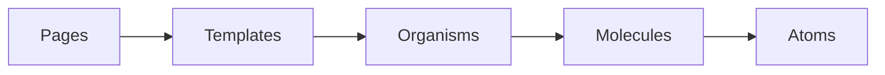

# Postable — Landing Page

Marketing landing page for **Postable**, an AI-powered social media content automation platform for Brazilian small businesses. This repo implements a conversion-focused landing page with bilingual support (PT/EN), interactive sections, and Atomic Design architecture.

**[Live preview](https://postable.com)** *(placeholder — replace with your deployed URL)*

---

## Tech Stack

| Layer | Technology |
|---|---|
| Framework | Next.js 16.1.6 (App Router) |
| UI | React 19.2.3 |
| Language | TypeScript 5 (strict mode, `@/*` alias to `src/`) |
| Styling | Tailwind CSS v4 |
| Fonts | Inter, DM Sans, Fraunces, Questrial, Geist, Plus Jakarta Sans (Google) + Stratford (local) |
| i18n | Custom `LanguageContext` + `useTranslation` hook — PT (default) / EN |
| Build | Turbopack (dev), Next.js compiler (prod) |

---

## Getting Started

```bash
npm install
npm run dev
```

Open [http://localhost:3000](http://localhost:3000).

```bash
npm run build   # production build
npm start       # serve production build locally
npm run lint    # ESLint
```

---

## Architecture

Components follow [Atomic Design](.cursor/rules/architecture.mdc). Dependency flow is strictly one-way:



```
src/
  app/                  # Next.js App Router (/, /privacy, /terms)
  components/
    atoms/              # Button, Typography, Badge, Icon
    molecules/          # NavItem, FAQItem, PainCard, FeatureListItem, etc.
    organisms/          # Header, HeroSection, PricingSection, etc.
    templates/          # LandingPageTemplate
  context/              # LanguageContext
  hooks/                # useTranslation, useScrollReveal
  locales/
    en/                 # English JSON files (hero.json, pricing.json, …)
    pt/                 # Portuguese JSON files
```

---

## i18n

Copy is driven by JSON locale files in `src/locales/`. The `useTranslation` hook exposes `t(key)` and `setLanguage`.

- **Default language:** PT
- **Persistence:** Preference saved to `localStorage` as `preferredLanguage`
- **Key format:** Dot-notation paths into the JSON, e.g. `t('hero.heading')` → `locales/pt/hero.json` → `{ "heading": "…" }`

### Adding a translation key

1. Add the key to `src/locales/pt/<section>.json` and `src/locales/en/<section>.json`
2. Call `t('section.key')` in your component (must be inside `LanguageProvider`)

Example — `src/locales/pt/hero.json`:

```json
{
  "heading": "Transforme tendências em clientes.",
  "subtitle": "Postable analisa seus concorrentes locais…"
}
```

In a component: `const { t } = useTranslation(); return <h1>{t("hero.heading")}</h1>`

---

## Adding a New Section

1. Create the organism in `src/components/organisms/<SectionName>/` (`.tsx`, `.types.ts`, `index.ts`)
2. Add locale keys to `src/locales/en/` and `src/locales/pt/` (e.g. `new-section.json`)
3. Import and add the component to the `sections` array in [`src/app/page.tsx`](src/app/page.tsx)

```tsx
// src/app/page.tsx
sections={[
  // …existing sections…
  <NewSection key="new-section" />,
]}
```

---

## Deployment

No environment variables required. Deploy to Vercel:

- **CLI:** `vercel` (after `npm install -g vercel`)
- **Git:** Push to GitHub and connect the repo in the [Vercel dashboard](https://vercel.com/new)

---

## Documentation

| Document | Description |
|---|---|
| [`docs/product/thesis.md`](docs/product/thesis.md) | Product thesis — problem, solution, ICP, competitive analysis, unit economics |
| [`docs/design/visual-identity.md`](docs/design/visual-identity.md) | Color system, typography, spacing, shape language, motion tokens |
| [`docs/design/page-structure.md`](docs/design/page-structure.md) | Section order, per-section design specs, conversion principles |
| [`docs/development/build-plan.md`](docs/development/build-plan.md) | Phased build checklist (Phases 0–19) |

---

## AI Tooling

This repo uses Cursor rules and skills to keep AI-generated code aligned with project conventions:

| Rule | Purpose |
|---|---|
| [`.cursor/rules/architecture.mdc`](.cursor/rules/architecture.mdc) | Atomic Design rules — dependency flow, naming, logic placement |
| [`.cursor/rules/commit-rules.mdc`](.cursor/rules/commit-rules.mdc) | Git commit conventions — English, atomic, prefixed messages |
