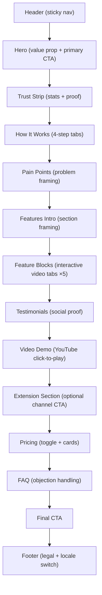

# Landing Page Structure — Postable

## Section Order

---

## Section-by-Section Specs

### Header

| Item | Spec |
|---|---|
| Behavior | Fixed top; transparent initially; scroll >100px → `bg-white/80 backdrop-blur-md border-b border-[#E0E0E0]`, compact padding |
| Desktop | Logo left + center floating nav pill + right CTA button |
| Mobile | Hamburger opens drawer with same nav links |
| Nav anchors | "Como funciona" → `#como-funciona` · "Funcionalidades" → `#funcionalidades` · "Preços" → `#precos` |
| Conversion role | Always keeps How It Works, Features, and Pricing one click away |

### Hero

| Item | Spec |
|---|---|
| Background | Pure white `#FFFFFF` |
| Badge | Small outline badge with animated dot above headline |
| Headline | `text-4xl md:text-6xl font-bold text-[#0A0A0A]` (DM Sans) |
| Subtitle | One sentence, `text-[#6B6B6B]` (Inter) |
| Primary CTA | Black button — "Começar teste grátis de 7 dias" |
| Secondary CTA | Ghost link — "Ver como funciona →" scrolls to `#como-funciona` |
| Micro-copy | "Sem cartão de crédito. Cancele quando quiser." in `text-[#B0B0B0]` |
| Motion | Sequential reveal: title → subtitle → CTA → badge (`duration-200 ease-out`) |

### Trust Strip

| Item | Spec |
|---|---|
| Layout | Thin editorial divider — centered uppercase label + 4 proof stats side by side |
| Proof stats | 28% queda Instagram · R$97/mês vs R$800–2.500 · < R$0,05 custo API · 7 dias grátis |
| Background | `border-y border-[#E0E0E0] bg-[#F5F5F5] py-10` |
| Source note | Caption below: "Fonte: Socialinsider 2025 Social Media Benchmarks Report" |

### How It Works

| Item | Spec |
|---|---|
| Interaction | 4 tab pills controlling a single content card below |
| Tab layout | `grid-cols-2` on mobile (2×2 grid), pill row on desktop |
| Content card | Large watermark step number (absolute, `text-[#F5F5F5] text-[120px]`) + icon + bold title + explanation |
| Active tab state | `useState(0)`, instant content swap |
| CTA | Black button "Começar agora — 7 dias grátis" below content card |
| Steps | 01 Onboarding → 02 Análise → 03 Gap → 04 Publicação |

### Pain Points

| Item | Spec |
|---|---|
| Layout | 4 cards in `grid-cols-1 sm:grid-cols-2 gap-5` |
| Card style | `bg-white border border-[#E0E0E0] rounded-xl` — numeric badge + pain statement + description |
| Background | `bg-[#F5F5F5]` to separate from previous section |
| Closing line | "Esse ciclo tem solução. E não precisa de agência." |
| Pain cards | 01 Não sabem o que postar · 02 Sem consistência, sem alcance · 03 Zero visibilidade competitiva · 04 Conteúdo não gera leads |

### Feature Blocks

| Item | Spec |
|---|---|
| Count | 5 interactive feature modules |
| Module layout | `grid-cols-1 lg:grid-cols-5` — left text 2 cols, right media 3 cols |
| Orientation | Even-numbered modules are `reverse` (media left, text right) |
| Left side | Outline badge + title + subtitle + clickable `FeatureListItem` list |
| Right side | Video panel that swaps on sub-feature click — autoplay muted looping mp4 |
| Video loading | Skeleton loader while video loads; `border border-[#E0E0E0]` around panel |
| Active state | `border-[#0A0A0A]` or `bg-[#F5F5F5]` on active list item (no color glows) |
| 5 blocks | Análise de gap competitivo · Geração de conteúdo estratégico · Aprovação e publicação · Automatização de distribuição · Análise de resultados |

### Testimonials

| Item | Spec |
|---|---|
| Layout | Two-column staggered grid (`md:grid-cols-2`), second column offset `md:mt-8` |
| Count | 6 cards |
| Card style | `border border-[#E0E0E0]`, highlighted quote phrase, 5-star line, avatar initials |
| Profiles | 6 Brazilian SMB owners across niches (nutricionista BH, personal SP, consultora Curitiba, dentista Porto Alegre, SaaS Recife, fisioterapeuta Florianópolis) |

### Video Demo

| Item | Spec |
|---|---|
| Initial state | Static thumbnail + play overlay — no YouTube embed until click |
| On click | Replace thumbnail with YouTube iframe |
| Style | `rounded-xl border border-[#E0E0E0] shadow-sm`, centered, generous padding |
| Localization | PT locale forces caption settings in embed URL params |

### Extension Section

| Item | Spec |
|---|---|
| Purpose | Optional Chrome extension acquisition channel |
| Card | `bg-[#F5F5F5] border border-[#E0E0E0] rounded-2xl` |
| CTA pair | Primary black button "Instalar extensão" + ghost link "Experimentar na plataforma" |

### Pricing

| Item | Spec |
|---|---|
| Anchor | `id="precos"` |
| Toggle | "Mensal / Anual" billing interval toggle — annual shows 20% discount badge |
| Plans | Básico R$97/mês · Avançado R$197/mês ("Mais popular") · Agência R$297/mês |
| Popular card | `border-[#0A0A0A]` prominent black border or `bg-[#F5F5F5]` |
| Annual prices | R$78 · R$158 · R$238/mês |
| Trial chip | "7 dias grátis" badge on each card |
| Foot note | "Sem cartão de crédito · Cancele quando quiser" |

### FAQ

| Item | Spec |
|---|---|
| Anchor | `id="faq"` |
| Layout | Narrow centered accordion — `max-w-3xl mx-auto` |
| Behavior | Single-open: only one item open at a time |
| Positioning | After pricing, to handle objections at the decision moment |
| Entries | 5 questions covering pricing, experience, post approval, competitor analysis, and business fit |

### Final CTA

| Item | Spec |
|---|---|
| Background | `bg-[#F5F5F5]` or bordered white — not aggressive "last chance" tone |
| Headline | "Seus concorrentes não vão esperar." |
| CTA | Black button — "Começar teste grátis de 7 dias" |
| Micro-copy | "Sem cartão de crédito · Cancele quando quiser · Primeiro post em menos de 10 minutos" |

### Footer

| Item | Spec |
|---|---|
| Background | `bg-[#0A0A0A]` or `bg-white` with top border |
| Content | Logo + tagline + legal links (Termos / Privacidade) + copyright |
| Tone | Lightweight — no heavy link grids |

---

## Conversion Principles

| Do | Avoid |
|---|---|
| Keep backgrounds mostly clean — let content guide attention | Full-saturation backgrounds in every section |
| Use light typography with strong spacing hierarchy | Heavy font weights everywhere |
| Alternate feature layouts to prevent visual fatigue | Repeating the exact same left-right composition 5 times |
| Show product via short looping clips | Relying only on icon cards and copy |
| Reuse the same CTA style and wording family | Different CTA language every section |
| Put FAQ after pricing | FAQ too early, before users are price-aware |
