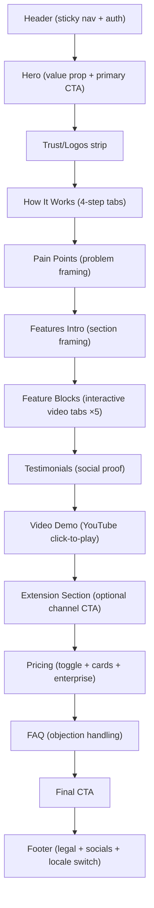

No commits were made.

**Landing Page Design Blueprint (Replicable Plan)**

**1) Global Design System (Copy This First)**

| Layer | Spec |
|---|---|
| Color base | White background + dark text + mango/orange primary (`--primary: 21 98% 59%`) |
| Accent strategy | Use very light tinted backgrounds (`primary/5`, `slate-50`) + radial glow overlays for feature cards |
| Typography | Body is Lexend; consistent light weights (`font-light`) with occasional medium emphasis |
| Shape language | Rounded components everywhere (`rounded-xl`, `rounded-2xl`, `rounded-3xl`) |
| Borders | Soft border system (`border-border`) instead of heavy shadows-only UI |
| Spacing rhythm | Section wrapper: `py-16`, container `max-w-7xl`, default `px-4` |
| Motion language | Mostly fade-up + slight y-offset + gentle easing `[0.16,1,0.3,1]` |
| CTA style | Repeated black button with white text (`bg-black text-white rounded-xl`) |

Design references: [globals.css](/Users/leostuart/magic-mango/landing-page/src/app/globals.css), [tailwind.config.ts](/Users/leostuart/magic-mango/landing-page/tailwind.config.ts), [section.tsx](/Users/leostuart/magic-mango/landing-page/src/components/section.tsx)

---

**2) Section-by-Section Design Specs**

### Header
| Item | Design spec |
|---|---|
| Behavior | Fixed top; transparent initially; after scroll >100px becomes blurred, translucent, compact |
| Desktop | Center floating nav pill + right auth area + language switch |
| Mobile | Hamburger opens drawer with same nav priorities |
| Conversion role | Always keeps `How It Works`, `Features`, `Pricing` one click away |
| Key styling | `bg-background/80`, `backdrop-blur-md`, smooth transition |

Refs: [header.tsx](/Users/leostuart/magic-mango/landing-page/src/components/sections/header.tsx), [menu.tsx](/Users/leostuart/magic-mango/landing-page/src/components/menu.tsx), [drawer.tsx](/Users/leostuart/magic-mango/landing-page/src/components/drawer.tsx)

### Hero
| Item | Design spec |
|---|---|
| Core composition | Big rotating headline + concise subtitle + primary CTA + secondary “watch demo” CTA |
| Background | Animated multicolor radial blobs (orange/yellow/green spectrum) |
| Typography | `text-4xl` to `md:text-6xl`, light weight, tight tracking |
| Motion | Sequential reveal of title, subtitle, CTA, then creative strip |
| Supporting visual | Horizontal auto-scrolling creative collage (`creativeCards.webp`) |
| Design intention | Communicate “premium AI creative platform” in first 5 seconds |

Refs: [hero.tsx](/Users/leostuart/magic-mango/landing-page/src/components/sections/hero.tsx), [animated-gradient-bg.tsx](/Users/leostuart/magic-mango/landing-page/src/components/magicui/animated-gradient-bg.tsx), [creativeCards.tsx](/Users/leostuart/magic-mango/landing-page/src/components/sections/creativeCards.tsx), [rotating-phrase.tsx](/Users/leostuart/magic-mango/landing-page/src/components/rotating-phrase.tsx)

### Logos / Trust strip
| Item | Design spec |
|---|---|
| Layout | Thin editorial divider with centered uppercase label + grayscale logos |
| Motion | Logos fade/slide in staggered |
| UX effect | Quiet credibility, not loud testimonial overload |
| Styling | Low-opacity logos that brighten on hover |

Ref: [logos.tsx](/Users/leostuart/magic-mango/landing-page/src/components/sections/logos.tsx)

### How It Works
| Item | Design spec |
|---|---|
| Layout | Section title + interactive tabs + one large content card |
| Interaction | Tab switch controls screenshot/text pair |
| Card design | Large watermark step number, icon chip, text block, screenshot panel |
| Responsive | 2x2 tab grid on mobile; pill row on desktop |
| Visual hierarchy | Step number + icon + bold title + plain explanation |
| Conversion | CTA appears immediately below content card |

Refs: [how-it-works.tsx](/Users/leostuart/magic-mango/landing-page/src/components/sections/how-it-works.tsx), [how-it-works-tabs.tsx](/Users/leostuart/magic-mango/landing-page/src/components/how-it-works-tabs.tsx)

### Pain Points
| Item | Design spec |
|---|---|
| Layout | 4 cards in 2-column desktop grid |
| Card style | White card, subtle border, small numeric badge (`01..04`), italic pain statement |
| Motion | Staggered card entrance; emotional transition line at bottom |
| Background | Soft primary tint to separate from previous section |
| Strategy | Agitate before presenting full solution stack |

Ref: [problem.tsx](/Users/leostuart/magic-mango/landing-page/src/components/sections/problem.tsx)

### Features Intro + Repeating Feature Modules
| Item | Design spec |
|---|---|
| Intro block | Centered title/subtitle before modules |
| Module layout | 5-column grid: left text stack (2 cols), right media panel (3 cols) |
| Left side | Badge, title, subtitle, CTA, clickable feature list |
| Right side | Video panel that swaps based on selected feature |
| Visual rhythm | Alternate module orientation (`reverse`) and accent radial color per module |
| Media behavior | Skeleton while video loads; autoplay muted looping mp4 |
| Reuse pattern | One component repeated with different copy/assets |

Refs: [page.tsx](/Users/leostuart/magic-mango/landing-page/src/app/[locale]/page.tsx), [feature-section.tsx](/Users/leostuart/magic-mango/landing-page/src/components/sections/feature-section.tsx)

### Testimonials
| Item | Design spec |
|---|---|
| Layout | Vertical marquee cards in columns with gradient fade masks top/bottom |
| Card style | Clean bordered cards, highlighted phrases, 5-star line, avatar/initials |
| Motion | Slow auto-scroll gives “continuous social proof” feel |
| UX | Feels dynamic without requiring user interaction |

Ref: [testimonials.tsx](/Users/leostuart/magic-mango/landing-page/src/components/sections/testimonials.tsx)

### Demo
| Item | Design spec |
|---|---|
| Interaction model | Static thumbnail + play overlay first, iframe only after click |
| Performance intent | Avoid heavy YouTube embed cost before intent |
| Style | Large framed video card (`shadow-2xl`, bordered), centered CTA below |
| Localization | Portuguese locale forces caption settings in embed URL |

Ref: [video-demo.tsx](/Users/leostuart/magic-mango/landing-page/src/components/sections/video-demo.tsx)

### Extension
| Item | Design spec |
|---|---|
| Role | Optional acquisition channel (Chrome extension) |
| Look | Rounded glass-like card (`bg-white/70`, blur, large radius) |
| CTA pair | Primary download + secondary in-platform trial link |
| Color | Neutral section with orange gradient text emphasis |

Ref: [extension.tsx](/Users/leostuart/magic-mango/landing-page/src/components/sections/extension.tsx)

### Pricing
| Item | Design spec |
|---|---|
| Data model | Dynamic plans from API, interval filter monthly/yearly |
| UX states | Skeleton loading, then animated pricing cards |
| Card design | Popular ribbon, animated gradient blobs, trial chip, seat chip, feature checklist |
| Interaction | Billing toggle persists in localStorage |
| Visual hierarchy | Big price, billing cadence, feature list, strong CTA |
| Enterprise | Full-width asymmetric card below plan grid |
| Trust detail | “7-day trial” shown in section + card-level chips |

Refs: [pricing.tsx](/Users/leostuart/magic-mango/landing-page/src/components/sections/pricing.tsx), [billingIntervalToggle](/Users/leostuart/magic-mango/landing-page/src/components/molecules/billingIntervalToggle/index.tsx)

### FAQ
| Item | Design spec |
|---|---|
| Layout | Narrow centered accordion column |
| Interaction | Single-open collapsible with chevron rotation |
| Content style | Crisp Q/A, optional inline support link |
| Positioning | Comes after pricing to handle objections at decision moment |

Refs: [faq.tsx](/Users/leostuart/magic-mango/landing-page/src/components/sections/faq.tsx), [accordion.tsx](/Users/leostuart/magic-mango/landing-page/src/components/ui/accordion.tsx)

### Final CTA + Footer
| Item | Design spec |
|---|---|
| Final CTA | Soft tinted card-like section with one clear action |
| Footer | Lightweight legal links + social icons + tagline + language switch |
| Tone | Calm close, no aggressive “last chance” pressure |

Refs: [cta.tsx](/Users/leostuart/magic-mango/landing-page/src/components/sections/cta.tsx), [footer.tsx](/Users/leostuart/magic-mango/landing-page/src/components/sections/footer.tsx)

---

**3) Build Plan For Your New Landing Page**

### Phase 1: Foundation
- Define your design tokens first: primary hue, neutral scales, border radius, type scale, motion easing.
- Implement one reusable `Section` wrapper (title/subtitle/description + consistent spacing).
- Lock a CTA style and reuse it everywhere.

### Phase 2: Conversion Skeleton
- Ship section order exactly: Hero → How It Works → Pain Points → Features → Demo → Pricing → FAQ → CTA.
- Keep each section with a single dominant purpose (no mixed goals inside one block).
- Make nav anchors map to decision-critical sections (`how`, `features`, `pricing`).

### Phase 3: Interaction Layer
- Add one interactive pattern per major block only.
- Use tabs for process/feature explanation, accordion for objections.
- Keep transitions under ~600ms for most UI changes.

### Phase 4: Trust + Proof
- Add logos early and testimonials before demo/pricing.
- Put real product media in features and demo.
- Include pricing risk-reversal text close to CTA.

### Phase 5: Measurement
- Track section view, CTA clicks, pricing toggle, faq opens, video play.
- Add scroll-depth milestones for funnel diagnostics.
- Use these events to decide which section to rewrite first.

---

**4) Practical “Do This / Avoid This” Rules**

| Do this | Avoid this |
|---|---|
| Keep backgrounds mostly clean and let accent glows guide attention | Full-saturation backgrounds in every section |
| Use light typography with strong spacing hierarchy | Heavy font weights everywhere |
| Alternate feature layouts to prevent visual fatigue | Repeating the exact same left-right composition 5 times |
| Show product via short looping clips | Relying only on icon cards and copy |
| Reuse the same CTA style and wording family | Different CTA language every section |
| Put FAQ after pricing | FAQ too early, before users are price-aware |

---

**5) Fast Starter Template (Section Checklist)**

- [ ] Sticky header with anchor nav and mobile drawer  
- [ ] Hero with one core claim + one primary CTA + one secondary CTA  
- [ ] 3–4 logo strip  
- [ ] 4-step “How it works” interactive tabs  
- [ ] 4-card pain-point section  
- [ ] 3–5 interactive feature modules with video/image swaps  
- [ ] Testimonials strip or carousel  
- [ ] Click-to-play demo block  
- [ ] Dynamic pricing cards + billing toggle + enterprise CTA  
- [ ] 10–12 FAQ entries in accordion  
- [ ] Final CTA and concise footer  
- [ ] Event tracking for each conversion step  

If you want, I can turn this into a concrete implementation spec next: exact Tailwind class recipe per section + component tree (`/sections/*`) you can copy directly.